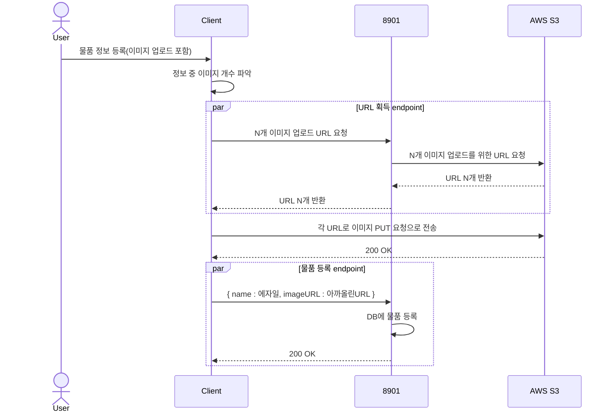

## 📌 우학동: 동아리 관리 자동화 SaaS

### System Architecture


### CI/CD


### ERD


### Challenge 1: 결제 누락 방지
주문 정보 선행 저장과 PortOne 측의 webhook 도입을 통한 결제 누락 방지 프로세스 구축
```mermaid
sequenceDiagram
    Actor User
    participant Client
    participant (8901)
    participant PortOne

    Client->>(8901): 동아리 등록에 필요한 정보 주세요 [/v1/clubs/{clubId}/join]
    (8901)-->> Client: { groupId:14, groupAmount:10000 }
    User->>Client: 주문하겠습니다.
    Client-->>Client: merchantUid를 유니크 값으로 생성 ( 1ab )
    Client->>(8901): { merchantUid : 1ab, groupId: 14 } 주문 가능? [/v1/groups/{groupId}/joins]
    (8901)-->(8901): merchantUid, groupId 바탕으로 DB에 저장
    (8901)-->>Client: OK { orderId:964 }
    Client->>PortOne: { merchantUid:1ab, groupAmount:10000 }로 주문 페이지 주세요 [ portOne API ]
    PortOne-->>PortOne: 주문 정보를 바탕으로 { impUid:983 } 생성
    PortOne-->>Client: 카카오페이 QR 코드 화면
    Client-->>User: 카카오페이 QR 코드 화면 전달
    User->>PortOne: 결제 
    PortOne->>(8901): { merchantUid:1ab, impUid:983 }  결제 완료 webhook
    (8901)-->(8901): 주문 정보와 결제 정보 비교
    PortOne-->>Client: { merchantUid:1ab, impUid:983, orderId:964 } 결제 완료 
    Client->>(8901): { merchantUid:1ab, impUid:983 } 결제 완료
    (8901)->>PortOne: { impUid:983, accessToken:tas } 정보 줘
    PortOne-->>(8901): { merchantUid:1ab, impUid:983 } 요기
    (8901)-->(8901): 주문 정보와 결제 정보 비교
    (8901)-->>Client: 주문 완료

```


### Challenge 2: Presigned URL을 이용한 이미지 등록 FLOW
이미지 전송 부하를 최소화하기 위해, 클라이언트에서 이미지를 직접 업로드할 수 있도록 Presigned URL 방식 채택


### Challenge 3: 선착순 가입
레디스 분산락 도입을 통해 선착순 가입 시에 발생하는 Race Condition을 해결하였다. 자세한 것은 [링크](https://jjunhub.tistory.com/3)


